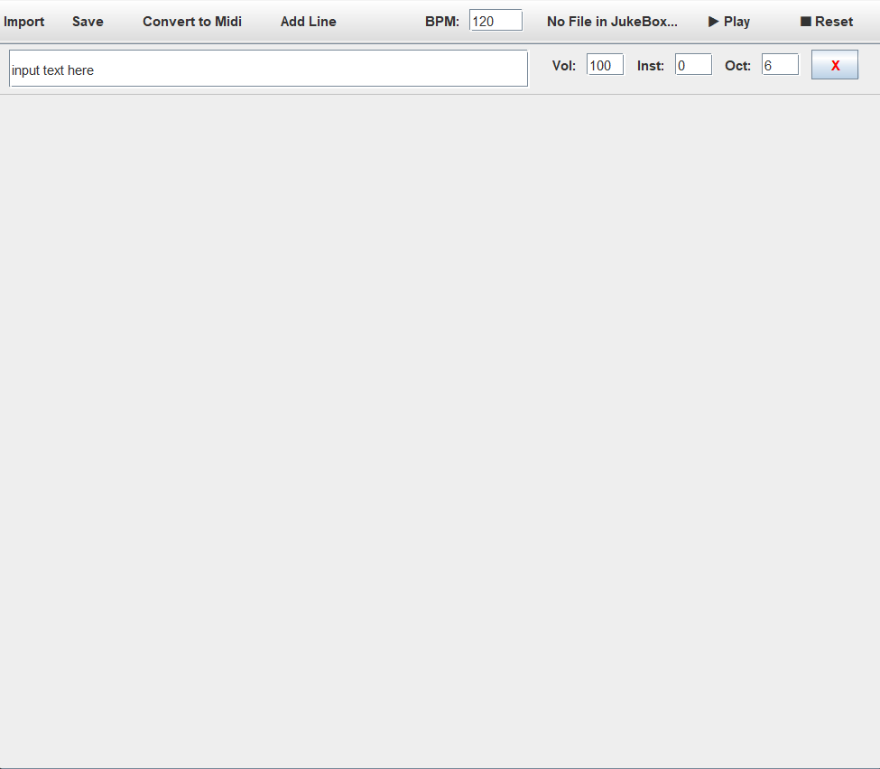

# Software_Development
Este repositório documentará o processo de confecção do projeto geral da disciplina de Desenvolvimento de Software (INF01120) na UFRGS
(*) Para mais informações sobre implementação e ideias do código, consultar wiki

observações:

### Propriedades do projeto
* No texto, cada linha gerará uma Voz, como proposto na teoria musical de Bach. Isso ocorrerá de tal forma que, Linha 0 => Voz[0] e, assim, sucessivamente de tal forma que cada linha implicará em uma Voz independente de outra.
* O botão *save* só salva o texto da partitura do usuário. os presets precisam ser inseridos a cada import (se não serão os padrão)
* O botão *Convert to Midi* converte o texto atualmente carregado na tela para o formato midi e salva-o em um arquivo
* BPM é global
* Valores Positivos maiores do que os especificados saturam no valor especificado
* Maior oitava é a Nona (9°) (octave = 9)
* Maior Volume = 127
* Bpm só precisa ser positivo


### Como Rodar o Projeto
Para rodar o projeto, você deve ter o ambiente virtual java instalado. Para mais ajuda [clique aqui](https://www.java.com/en/download/help/download_options.html)
0. Clone este repositório
```
    git clone https://github.com/joaopaulo902/Software_Development.git
```
1. Vá até o diretório raíz **do projeto**
```
    cd C:\[YourPathToProject]
```
2. Compile o código
```
    javac -d bin src/*.java  
```
3. Rode o executável via máquina virtual
```
    java -cp bin Main
```
#### Presets para vozes 

| Linha | Oitava Padrão | Tipo de Voz Padrão | Volume Padrão |
|:------|:-------------:|:-------------------|---------------|
| 0     |       6       | Piano (GM 0)       | 100           |
| 1     |       5       | Órgão (GM 20)      | 80            |
| 2     |       4       | Cravo (GM 6)       | 60            |
| 3     |       3       | Fagote (GM 71)     | 40            |
| 4     |       6       | ...                | ...           |
### Requisitos do Projeto
- **RF** - Requisito Funcional
- **RNF** - Requisito Não Funcional

|  #  | Project Directives                                                                                                                                                                                                                                                                                                                                                                                                                                                                                                                                                                                              | Requirement type |
|:---:|:----------------------------------------------------------------------------------------------------------------------------------------------------------------------------------------------------------------------------------------------------------------------------------------------------------------------------------------------------------------------------------------------------------------------------------------------------------------------------------------------------------------------------------------------------------------------------------------------------------------|:-----------------|
| 1.  | O software deve ler o texto de entrada num campo de texto na interface do software.                                                                                                                                                                                                                                                                                                                                                                                                                                                                                                                             | **RF**           |
| 2.  | O software deve interpretar caractere por caractere, aplicando as regras de mapeamento definidas na Tabela de Especificação dos Caracteres.                                                                                                                                                                                                                                                                                                                                                                                                                                                                     | **RF**           |
| 3.  | O software deve gerar uma saída musical audível e reproduzível associada à entrada.                                                                                                                                                                                                                                                                                                                                                                                                                                                                                                                             | **RF**           |
| 4.  | O software deve ser configurável pelo usuário (ex: Volume, velocidade de reprodução(BPM), Instrumento inicial, Oitava, número de faixas de reprodução).                                                                                                                                                                                                                                                                                                                                                                                                                                                         | **RF**           |
| 5.  | Deve ser possível salvar o texto atual                                                                                                                                                                                                                                                                                                                                                                                                                                                                                                                                                                          | **RF**           |
| 6.  | Deve ser possível pausar a reprodução da sequência                                                                                                                                                                                                                                                                                                                                                                                                                                                                                                                                                              | **RF**           |
| 7.  | Deve ser possível terminar a execução do programa                                                                                                                                                                                                                                                                                                                                                                                                                                                                                                                                                               | **RF**           |  
| 8.  | Deve ser possível especificar número de ticks de silêncio na forma [n]                                                                                                                                                                                                                                                                                                                                                                                                                                                                                                                                          | **RF**           |
| 9.  | Deve ser possível navegar dentro do texto de uma faixa para além do que é mostrado na tela inicialmente                                                                                                                                                                                                                                                                                                                                                                                                                                                                                                         | **RF**           |
| 10. | O código deve ser testável                                                                                                                                                                                                                                                                                                                                                                                                                                                                                                                                                                                      | **RNF**          |
| 11. | O software deve estar dividido modularmente. Módulos modelo: Boot, Geração da User Interface, Captação do Texto, Alteração das configurações pré-reprodução, Interpretação/Tradução do Texto, Geração de Eventos, Reprodução, Salvamento.                                                                                                                                                                                                                                                                                                                                                                       | **RNF**          |
| 12. | - Deve se usar a Aplicação dos princípios SOLID: <br> - S – Responsabilidade Única: cada classe deve ter apenas uma razão para mudar. <br> - O – Aberto/Fechado: o sistema deve ser extensível para novas regras ou novos formatos de saída sem modificar o código existente. <br> - L – Substituição de Liskov: as subclasses devem poder substituir suas classes base sem alterar o comportamento esperado. <br> - I – Segregação de Interfaces: interfaces específicas são melhores que uma interface genérica. <br> - D – Inversão de Dependência: depender de abstrações, não de implementações concretas. | **RNF**          |
| 13. | O software deve ser extensível                                                                                                                                                                                                                                                                                                                                                                                                                                                                                                                                                                                  | **RNF**          |
| 14. | O código deve ser legível                                                                                                                                                                                                                                                                                                                                                                                                                                                                                                                                                                                       | **RNF**          |

### Tabela de Especificação dos Caracteres

|        Caractere        | Comportamento                                          |
|:-----------------------:|:-------------------------------------------------------|
|            A            | Nota Lá                                                |
|            B            | Nota Si                                                |
|            C            | Nota Dó                                                |
|            D            | Nota Ré                                                |
|            E            | Nota Mi                                                |
|            F            | Nota Fá                                                |
|            G            | Nota Sol                                               |
|            H            | Nota Si♭                                               |
|            b            | Transforma a nota lida imediatamente após em Bemol     |
|          SPACE          | Dobra o volume até a **Altura de Saturação**           |
|            ?            | Aumenta uma oitava na linha                            |
|            V            | Diminui uma oitava na linha                            |
|            <            | Diminui o bpm global pela primeira linha(*)            |
|            >            | Aumenta o bpm global pela primeira linha(*)            | 
|            !            | Troca o instrumento para **MIDI #22** (Harmonica)      |
|        {I, O, U}        | Troca instrumento para **MIDI #110** (Gaita de fole)   |
|       Dígito par        | Troca instrumento para **MIDI #[Atual + Dígito lido]** |
|    ; ou Dígito ímpar    | Troca instrumento para **MIDI #15** (Tubular Bells)    |
|          **,**          | Troca instrumento para **MIDI #20** (Agogô)            |
|  {a, c, d, e, f, g, h}  | Gera silêncio                                          |
| [numero] (só no início) | Gera *numero* eventos de silêncio no comeco da musica  |
|         **Else*         | Gera silêncio                                          |
(*) como o BPM é indexado pela primeira linha, os caracteres '<' e '>' só surtem efeito se forem aplicados ali


### Bibliotecas/APIs inclusas

- javax.sound.midi; 
- java.util.*;
- javax.swing;
- java.io.*;
- java.swing.*;
- java.awt.*;
- java.nio.*;


### Interface

